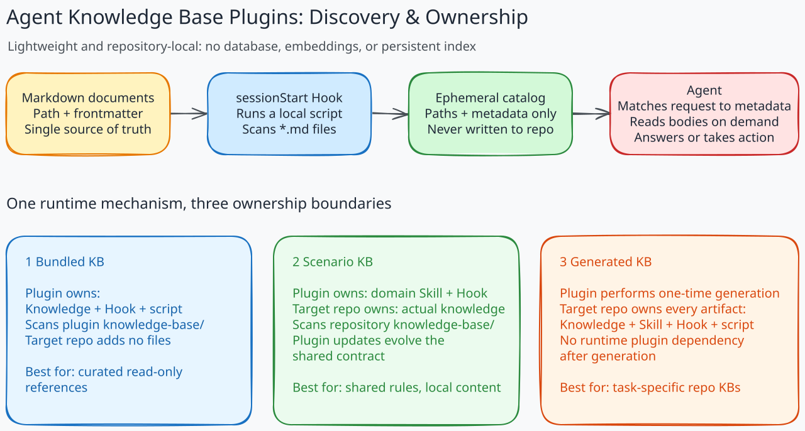

# Agent Knowledge Base Plugins

[简体中文](README_ZH.md) | English

Not every agent knowledge base needs MCP, a vector database, embeddings, or a standalone retrieval service. This repository explores a smaller alternative built entirely on **Agent Plugins 1.0**: version-controlled Markdown, Skills that define the knowledge contract, and session-start Hooks that make the knowledge discoverable.

The goal is not to replace full RAG infrastructure. It is to show a low-operations pattern for knowledge that should stay close to an agent, a scenario, or a repository.



## Core Idea

```text
Markdown documents
    -> sessionStart Hook scans paths and frontmatter
    -> lightweight catalog is injected into agent context
    -> agent matches the request against metadata
    -> agent reads only the relevant document bodies
```

Markdown remains the source of truth. A Skill defines where knowledge belongs, which metadata makes it discoverable, and how the agent should read and maintain it. A Hook runs a small local script at session start and injects only document paths and frontmatter metadata; bodies stay out of context until they are needed.

There is **no committed or generated index file**. “No index file” does not mean that discovery has no index-like step: the Hook builds an ephemeral catalog in memory for each new session. That catalog is never written back to the repository.

## Compared with an Index File

A common lightweight KB uses Markdown documents plus an `index.md` or JSON catalog. Both approaches avoid a database, but they make different tradeoffs.

| Concern | Hook-generated catalog in this repository | Markdown + committed index file |
| --- | --- | --- |
| Source of truth | Document path and frontmatter | Documents plus a separate index |
| Freshness | Rebuilt from the current files at session start | Must be edited or regenerated when files change |
| Maintenance | No synchronization step or index merge conflicts | Supports deliberate curation, but can become stale |
| Discovery quality | Simple metadata matching guided by a Skill | Can provide hand-written ordering, summaries, and relationships |
| Runtime cost | Scans files at startup and spends context on every catalog entry | Reads a ready-made artifact with predictable cost |
| Best fit | Small or medium, frequently edited, repository-local collections | Collections that need a carefully curated navigation layer or cannot run Hooks |

The Hook approach removes duplicate state and makes add, move, and delete operations self-updating. Its limits are equally important: startup work and injected context grow with the number of documents, metadata matching has no vector ranking or full-text retrieval, and it depends on a runtime that supports Agent Plugin Hooks.

For a very large corpus, multi-tenant access control, cross-system data, advanced ranking, or independently operated retrieval, MCP and database-backed solutions remain the better fit.

## Three Ownership Patterns

The examples use the same discovery mechanism but place the knowledge contract and content at different ownership boundaries.

| Example | Plugin owns | Target repository owns | Best for |
| --- | --- | --- | --- |
| `bundled-kb` | Knowledge, Hook, and loading instructions | Nothing | Publishing a curated, read-only reference with the plugin |
| `scenario-kb` | Domain Skill, document rules, and Hook | Scenario-specific knowledge | Sharing one workflow while each team maintains its own content |
| `generated-kb` | One-time generation workflow and templates | The complete generated KB system | Giving one repository and recurring task a custom, self-contained contract |

### 1. Bundled KB: Knowledge Ships with the Plugin

`bundled-kb` packages the Markdown documents and the discovery Hook together. The Hook scans the plugin's own `knowledge-base/`, so the consuming repository does not need to add or maintain any files.

This fits stable reference material curated by one publisher and consumed read-only by many users: standards, common engineering guidance, product documentation, or a maintained handbook. Updating the plugin updates both the knowledge and its discovery behavior.

The source repository's [.github/instructions/bundled-kb.instructions.md](.github/instructions/bundled-kb.instructions.md) is the authoring contract for this plugin-owned knowledge. Its `applyTo` scope covers the bundled Markdown files and defines their organization, frontmatter, content quality, and validation. It guides plugin maintainers and is not a runtime dependency for consumers.

```text
plugins/bundled-kb/
    knowledge-base/       # plugin-owned documents
    hooks/hooks.json      # session-start entry point
    scripts/              # ephemeral catalog builder
```

### 2. Scenario KB: Contract in the Plugin, Knowledge in the Repository

`scenario-kb` fixes a reusable domain workflow while leaving the actual knowledge to each target repository. Its concrete example is a recipe book: the Skill defines cuisine directories, recipe frontmatter, content requirements, substitutions, scaling, and update rules; each household or team owns its own recipes under `knowledge-base/`.

```text
plugin                                 target repository
skills/scenario-kb/SKILL.md            knowledge-base/recipes/**/*.md
hooks/hooks.json
scripts/inject-session-context.py
```

This pattern suits organizations that want one governed structure across many repositories without centralizing their content. Updating the plugin updates the shared contract, while every repository retains a reviewable history of its own knowledge.

The workflow is:

1. Install `scenario-kb` and run `/scenario-kb setup` in the target repository.
2. Add or import one recipe per Markdown file according to the Skill.
3. Start a new agent session; the Hook scans the repository's `knowledge-base/`.
4. For a cooking request, the agent selects matching metadata and reads only the relevant recipes.
5. When a recipe changes, the Skill keeps quantities, yield, timing, paths, and metadata consistent.

### 3. Generated KB: The Repository Owns Everything

`generated-kb` is a generator rather than a runtime dependency. Given one repository and one recurring task, it inspects the relevant evidence and creates a task-specific knowledge contract and initial knowledge:

```text
knowledge-base/
    {task-specific structure and documents}
.github/
    skills/{task}-kb/SKILL.md
    hooks/{task}-kb.json
scripts/
    inject-session-context.py
```

Run `/generated-kb <recurring task>` in the target repository. The generated Skill defines what knowledge qualifies, where it belongs, and how it is maintained. The generated Hook builds the session catalog. Once generation is complete, the repository owns every artifact and no longer needs this plugin to use or evolve the KB.

This pattern fits repository-specific work whose terminology, evidence, and decisions cannot be captured well by a shared generic contract: release operations, incident diagnosis, architecture decisions, migration playbooks, or recurring maintenance tasks.

## Choosing a Pattern

- Choose `bundled-kb` when the publisher owns both the knowledge and its release cycle.
- Choose `scenario-kb` when many repositories share the same rules but own different content.
- Choose `generated-kb` when one repository needs a purpose-built system with no long-term plugin dependency.

## Install

```shell
copilot plugin marketplace add lanbaoshen/agent-knowledge-base-plugins
copilot plugin install bundled-kb@kb
copilot plugin install scenario-kb@kb
copilot plugin install generated-kb@kb
```

Start a new Copilot session after installing a plugin. To try the scenario example, ask `How do I make tomato and egg stir-fry?` directly and run `/scenario-kb setup` in the recipe repository. For a repository-specific system, run `/generated-kb <recurring task>` in that repository.

## Feedback

If this approach is useful or sparks an idea, consider [starring the repository](https://github.com/lanbaoshen/agent-knowledge-base-plugins). Questions, alternatives, and real-world experience are welcome in [GitHub Issues](https://github.com/lanbaoshen/agent-knowledge-base-plugins/issues).
