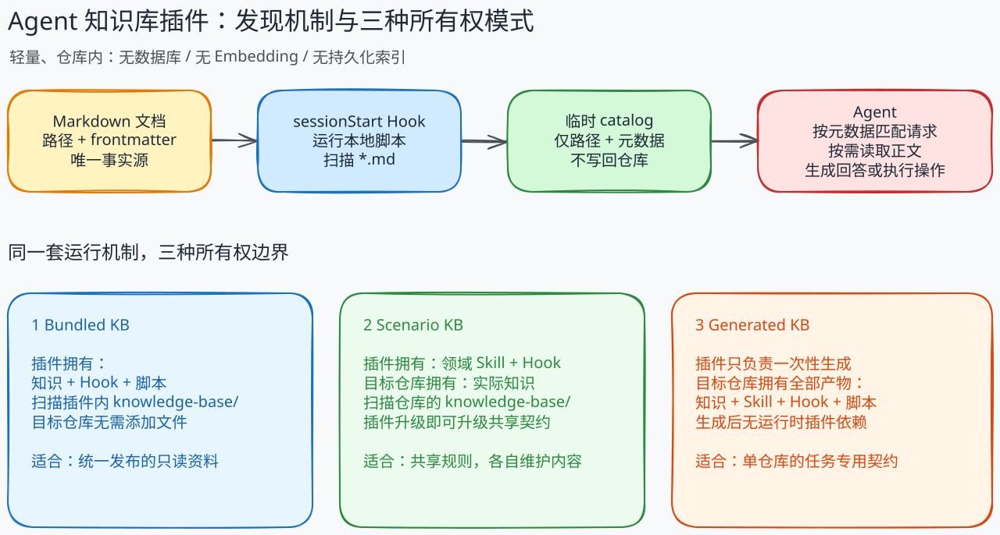

# Agent 知识库插件

[English](README.md) | 简体中文

并不是每个 Agent 知识库都需要 MCP、向量数据库、Embedding 或独立的检索服务。这个仓库探索了一种完全基于 **Agent Plugins 1.0** 的更轻方案：使用版本控制下的 Markdown 保存知识，使用 Skill 定义知识契约，再由会话启动 Hook 让 Agent 发现这些知识。

它并不试图替代完整的 RAG 基础设施，而是为“知识应该贴近 Agent、业务场景或代码仓库”的情况提供一种低运维实现。



## 核心思路

```text
Markdown 文档
    -> sessionStart Hook 扫描路径与 frontmatter
    -> 将轻量 catalog 注入 Agent 上下文
    -> Agent 根据元数据匹配用户请求
    -> 只读取相关文档的正文
```

Markdown 是唯一知识源。Skill 负责定义知识放在哪里、哪些元数据用于发现，以及 Agent 应如何读取和维护知识。Hook 在会话启动时运行一个很小的本地脚本，只注入文档路径和 frontmatter 元数据；正文只有在相关时才会被读取。

仓库中**没有需要提交或生成的 index 文件**。“没有 index 文件”并不等于完全没有索引过程：Hook 会为每个新会话在内存中临时生成 catalog，但不会把它写回仓库。

## 与 Index 文件方案相比

另一种常见的轻量知识库是 Markdown 文档加一个 `index.md` 或 JSON 目录。两者都不需要数据库，但取舍不同。

| 维度 | 本仓库的 Hook 动态 catalog | Markdown + 持久化 index 文件 |
| --- | --- | --- |
| 唯一事实源 | 文档路径与 frontmatter | 文档和单独的 index |
| 新鲜度 | 每次会话启动都从当前文件重建 | 文件变化后必须手动更新或重新生成 |
| 维护成本 | 无同步步骤，也没有 index 合并冲突 | 可以精细编排，但可能过期 |
| 发现能力 | 由 Skill 约束的简单元数据匹配 | 可以手写顺序、摘要和文档关系 |
| 运行成本 | 启动时扫描文件，每个条目都会占用上下文 | 直接读取现成产物，成本更可预测 |
| 更适合 | 中小规模、频繁变化、仓库内维护的知识 | 需要精心策划的导航层，或无法运行 Hook 的环境 |

Hook 方案消除了重复状态，文档的新增、移动和删除会自动反映到下一个会话。它的局限也很明确：启动扫描和注入上下文会随文档数量增长；元数据匹配不具备向量排序或全文检索能力；运行环境还必须支持 Agent Plugin Hooks。

当知识规模很大，或者需要多租户权限、跨系统数据、高级排序、独立部署与运维时，MCP 和数据库方案仍然更合适。

## 三种所有权模式

三个示例使用同一套发现机制，但把知识契约和知识内容放在不同的所有权边界中。

| 示例 | 插件拥有 | 目标仓库拥有 | 适用场景 |
| --- | --- | --- | --- |
| `bundled-kb` | 知识、Hook 和加载说明 | 无 | 随插件发布一套经过整理的只读知识 |
| `scenario-kb` | 领域 Skill、文档规则和 Hook | 场景特有的知识 | 多个团队共享同一工作流，各自维护内容 |
| `generated-kb` | 一次性的生成流程和模板 | 生成后的整套 KB 系统 | 为一个仓库和一项重复任务建立自包含契约 |

### 1. Bundled KB：知识随插件发布

`bundled-kb` 把 Markdown 文档和发现 Hook 一起打包。Hook 扫描插件自身的 `knowledge-base/`，所以使用方仓库不需要添加或维护任何文件。

它适合由一个发布者维护、供多位用户只读消费的稳定资料，例如规范、通用工程指南、产品文档或维护手册。升级插件时，知识和发现逻辑会一起升级。

源码仓库中的 [.github/instructions/bundled-kb.instructions.md](.github/instructions/bundled-kb.instructions.md) 是这批插件自带知识的编写契约。它通过 `applyTo` 作用于 bundled Markdown 文档，并约束目录组织、frontmatter、正文质量和验证流程。它服务于插件维护者，不是使用方的运行时依赖。

```text
plugins/bundled-kb/
    knowledge-base/       # 插件拥有的文档
    hooks/hooks.json      # 会话启动入口
    scripts/              # 临时 catalog 构建器
```

### 2. Scenario KB：契约属于插件，知识属于仓库

`scenario-kb` 固定一套可复用的领域工作流，把实际知识留给各个目标仓库。仓库中的具体示例是菜谱：Skill 定义菜系目录、菜谱 frontmatter、正文要求、替代食材、份量换算和更新规则；每个家庭或团队在自己的 `knowledge-base/` 中拥有自己的菜谱。

```text
插件                                   目标仓库
skills/scenario-kb/SKILL.md            knowledge-base/recipes/**/*.md
hooks/hooks.json
scripts/inject-session-context.py
```

它适合希望多个仓库遵循同一套治理结构、但不希望集中保存内容的组织。升级插件即可升级共享契约，而每个仓库仍保留自己可审查的知识历史。

工作流程如下：

1. 安装 `scenario-kb`，在目标仓库运行 `/scenario-kb setup`。
2. 按照 Skill 添加或导入菜谱，每份菜谱使用一个 Markdown 文件。
3. 启动新的 Agent 会话，Hook 扫描仓库中的 `knowledge-base/`。
4. 收到烹饪请求时，Agent 先匹配元数据，再只读取相关菜谱。
5. 菜谱变化时，Skill 保证用量、份量、时间、路径和元数据保持一致。

### 3. Generated KB：一切归目标仓库所有

`generated-kb` 是生成器，而不是运行时依赖。给定一个仓库和一项重复性任务，它会检查相关证据，并生成任务专用的知识契约与初始知识：

```text
knowledge-base/
    {任务专用的结构和文档}
.github/
    skills/{task}-kb/SKILL.md
    hooks/{task}-kb.json
scripts/
    inject-session-context.py
```

在目标仓库运行 `/generated-kb <重复性任务>`。生成的 Skill 定义哪些知识值得保存、应放在哪里以及如何维护；生成的 Hook 构建会话 catalog。生成完成后，目标仓库拥有全部产物，使用和演进这套知识库都不再依赖本插件。

它适合无法用通用契约准确描述的仓库专用工作，例如发布流程、故障诊断、架构决策、迁移手册或周期性维护任务。

## 如何选择

- 发布者同时拥有知识和发布周期时，选择 `bundled-kb`。
- 多个仓库共享规则、但拥有不同内容时，选择 `scenario-kb`。
- 单个仓库需要量身定制且不希望长期依赖插件时，选择 `generated-kb`。

## 安装

```shell
copilot plugin marketplace add lanbaoshen/agent-knowledge-base-plugins
copilot plugin install bundled-kb@kb
copilot plugin install scenario-kb@kb
copilot plugin install generated-kb@kb
```

安装插件后启动一个新的 Copilot 会话。体验场景方案时，直接询问 `西红柿鸡蛋怎么做`, 在菜谱仓库运行 `/scenario-kb setup`；生成仓库专用方案时，在目标仓库运行 `/generated-kb <重复性任务>`。

## 交流

如果这个方案对你有帮助或带来了一些启发，欢迎为[这个仓库点个 Star](https://github.com/lanbaoshen/agent-knowledge-base-plugins)。也欢迎通过 [GitHub Issues](https://github.com/lanbaoshen/agent-knowledge-base-plugins/issues) 分享问题、替代方案和真实使用经验。
